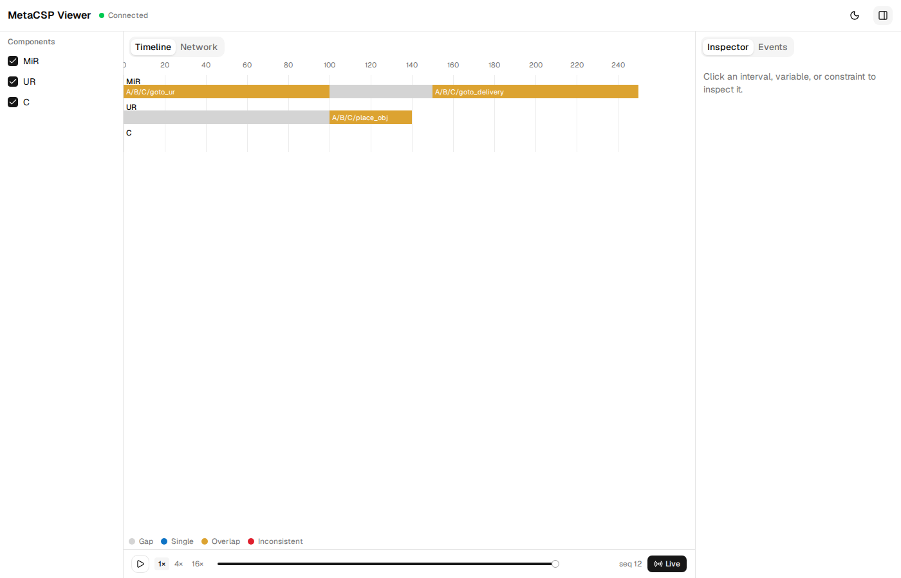

# metacsp

Python port of the [Meta-CSP Framework](https://github.com/FedericoPecora/meta-csp-framework)
by Federico Pecora — a library for meta-CSP based hybrid constraint reasoning: simple temporal
problems (STP), Allen interval algebra (crisp and fuzzy), resource scheduling, spatial reasoning
(DE9IM, RCC, rectangle/block algebra), Boolean satisfiability, trajectory envelopes and
spatio-temporal path scheduling, plus online sensing and dispatching.

Backed by native-code libraries: numpy (temporal propagation), Shapely/GEOS (geometry —
GEOS is itself the C++ port of the JTS library the Java original used), PySAT (SAT solving),
and sympy (CNF conversion).

## Install

```bash
pip install -e ".[dev]"      # development (tests, formatter, viz server deps)
pip install -e ".[viz]"      # optional live viewer only
```

## Quickstart

```python
from metacsp.time.apsp_solver import APSPSolver
from metacsp.time.simple_distance_constraint import SimpleDistanceConstraint

solver = APSPSolver(0, 1000)
a, b = solver.create_variables(2)
c = SimpleDistanceConstraint()
c.minimum, c.maximum = 10, 20
c.from_ = a
c.to = b
print("Consistent?", solver.add_constraint(c))
```

Runnable demos live in `examples/` — plain, standalone Python scripts, e.g.:

```bash
python examples/test_apsp_solver.py
python examples/tutorial/dispatching/simple_dispatching_example.py  # interactive
```

`examples/tutorial/` ports the demos of the separate
[meta-csp-tutorial](https://github.com/FedericoPecora/meta-csp-tutorial) repo — end-to-end
trajectory-envelope coordination, dispatching, and proactive-planning scenarios that exercise
the library the way a robot integration would.

`examples/SKIPPED.md` lists the handful of upstream Java examples that could not be
meaningfully ported (Swing-only, dead upstream code, or missing fixtures), each with a
one-line reason.

## Live viewer



A browser-based live Gantt view of any solver's activity timelines, backed by a websocket
server (see [`docs/VIZ.md`](docs/VIZ.md) for the wire protocol):

```python
from metacsp.viz import serve

server = serve(solver, ["Robot1", "Robot2"])  # opens a browser tab
```

```bash
pip install metacsp[viz]
python examples/viz_timeline_demo.py
```

## Status

| Feature area | Java package | Python module |
|---|---|---|
| Utilities (logging, math, graph) | `utility/` | `metacsp.utility` |
| Framework core & meta-CSP search | `framework/` | `metacsp.framework` |
| Simple temporal problems (STP/APSP) | `time/` | `metacsp.time` |
| Allen interval algebra (crisp & fuzzy) | `multi/allenInterval/`, `fuzzyAllenInterval/` | `metacsp.multi.allen_interval`, `metacsp.fuzzy_allen_interval` |
| Activities & timelines | `multi/activity/` | `metacsp.multi.activity` |
| Symbolic variables & Boolean SAT | `multi/symbols/`, `booleanSAT/` | `metacsp.multi.symbols`, `metacsp.boolean_sat` |
| Spatial geometry & constraint solving | `spatial/geometry/` | `metacsp.spatial.geometry` |
| RCC, cardinal direction, reachability | `spatial/{RCC,cardinal,reachability}/` | `metacsp.spatial.{rcc,cardinal,reachability}` |
| DE9IM spatial relations | `multi/spatial/DE9IM/` | `metacsp.multi.spatial.de9im` |
| Rectangle/block/temporal-rectangle algebras | `multi/spatial/{rectangleAlgebra,blockAlgebra}/` | `metacsp.multi.spatial.{rectangle_algebra,block_algebra}` |
| Trajectory envelopes | `multi/spatioTemporal/` | `metacsp.multi.spatio_temporal` |
| Meta TCSP & resource schedulers | `meta/TCSP/`, `meta/symbolsAndTime/` | `metacsp.meta.tcsp`, `metacsp.meta.symbols_and_time` |
| Simple planner & hybrid planner | `meta/simplePlanner/`, `meta/hybridPlanner/` | `metacsp.meta.simple_planner`, `metacsp.meta.hybrid_planner` |
| Trajectory envelope scheduler | `meta/spatioTemporal/paths/` | `metacsp.meta.spatio_temporal.paths` |
| Sensing & dispatching | `sensing/`, `dispatching/` | `metacsp.sensing`, `metacsp.dispatching` |
| Online monitoring (fuzzy hypothesis inference) | `onLineMonitoring/` | `metacsp.online_monitoring` |
| JSON serialization (snapshot/delta) | — (new) | `metacsp.serialization` |
| Live viewer (browser-based, replaces Swing) | `utility/UI/`, `utility/timelinePlotting/` | `metacsp.viz` (`viz` extra) |

Full milestone-by-milestone status, architecture decisions, and porting conventions are in
[PLAN.md](PLAN.md).

## License

MIT — see [LICENSE](LICENSE). Original Java framework © Federico Pecora.
